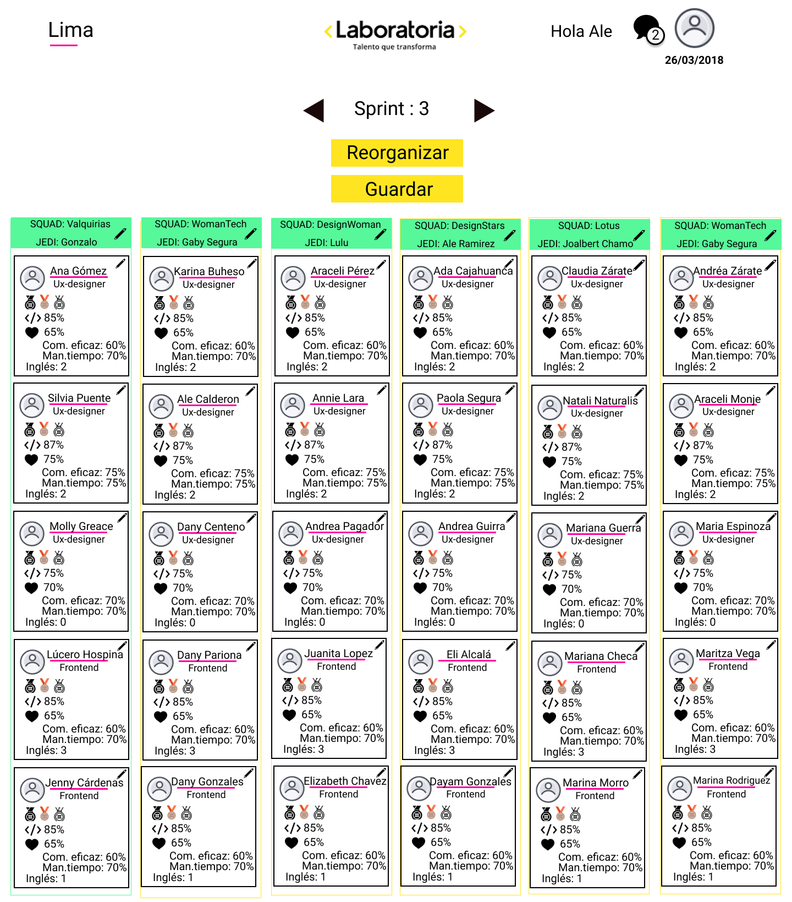

# **RETO : DISTRIBUCIÓN DE SQUADS**
Aprender en squads nos trae muchos beneficios, sin embargo, generar estos squads cada sprint es una tarea tediosa para las Training Managers. Creemos que esta distribución de squads puede ser más automática y así le facilitar la vida a las Training Managers. 

Es por eso que se solicitó rediseñar y modificar parte del flujo, creando una herramienta que redistribuya los squads de cada sprint, teniendo en cuenta distintas variables.

## **Qué variables tenemos en cuenta**
  - % tech skills
  - % soft skills:
    - Comunicación eficaz
    - Manejo del tiempo
  - Nivel de inglés
  - Perfil
  - Que no hayan estado en un mismo squad antes

## **Consideraciones**
Los squads son de 6 estudiantes, y su distribución debería incluir como mínimo:

  - 1 estudiante con nota tech mayor a 70%
  - 1 estudiante con comunicación eficaz mayor a 70%
  - 1 estudiante con nivel de inglés 2  o 3
  - 1 estudiante con nivel de inglés 0 o 1
  Datos adicionales

## **Los niveles de inglés se miden así:**
  - 0: Sin conocimientos
  - 1: Básico
  - 2: Intermedio
  - 3: Avanzado

**PROYECTO REALIZADO POR:**

**Frontend:**
  - Lúcero Hospina
  - Annie
  - Jennifer

**Ux-Designer:**
  - Silvia Puente de la Vega Vilca
  - Molly Greace
